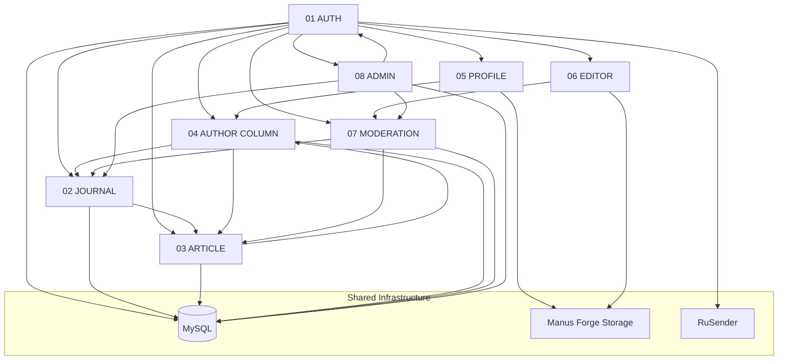

# MVP Technical Map — «Мой посёлок» MVP 1.0

**Назначение документа:** карта существующего рабочего кода для передачи другому AI-агенту разработки.  
**Режим анализа:** read-only, без изменений прикладного кода.  
**Baseline репозитория:** `main` @ `028c97cf` (стабильная точка отсчёта в project docs).  
**Стек:** React 19 + Vite + Express + tRPC + MySQL + Drizzle ORM.

---

## 1. Общая архитектура MVP

### 1.1. Монолит SPA + API

```
Browser
  └── React SPA (client/src)
        ├── wouter routes (client/src/App.tsx)
        ├── tRPC client → POST /api/trpc/*
        └── cookie app_session_id (+ optional sessionStorage Bearer)

Express (server/_core/index.ts)
  ├── POST /api/trpc/*        → appRouter (server/routers.ts)
  ├── GET  /manus-storage/*   → Forge presign proxy (server/_core/storageProxy.ts)
  ├── GET  /api/oauth/callback → Manus OAuth (server/_core/oauth.ts)
  └── POST /api/scheduled/*   → cron jobs (Manus JWT)

MySQL ← Drizzle (drizzle/schema.ts, drizzle/*.sql)
External: RuSender (email OTP), Manus Forge (S3 storage, cron, notifications)
```

### 1.2. Слои кода

| Слой | Путь | Роль |
|------|------|------|
| Routes / shell | `client/src/App.tsx`, `client/src/components/SiteShell.tsx` | Маршрутизация, навигация, auth modal |
| Pages | `client/src/pages/*.tsx` | Экранные модули MVP |
| Shared UI | `client/src/components/**` | Переиспользуемые компоненты |
| Auth context | `client/src/contexts/AuthContext.tsx` | Сессия, signIn/signOut |
| API client | `client/src/lib/trpc.ts`, `client/src/main.tsx` | tRPC + cookie/Bearer |
| Routers | `server/routers.ts` | Все tRPC namespaces |
| DB layer | `server/db.ts` | SQL/Drizzle операции |
| Schema | `drizzle/schema.ts` | Таблицы и связи |
| Shared types | `shared/*.ts` | Контент, пароли, константы |

### 1.3. Feature flags (platform governance)

MVP-модули журнала и редактора завязаны на флаги из `server/platformGovernance.ts`, отдаются через `platform.features`:

| Flag | MVP scope |
|------|-----------|
| `journal` | Родительский раздел Журнал |
| `journal_articles` | Лента, статья, автор |
| `journal_create_article` | Редактор, `/write` |
| `journal_column` | Колонка редакции |
| `journal_comments` | Комментарии |
| `journal_reactions` | Лайки |
| `journal_saved` | Избранное, подписки на авторов |
| `project_about` | «О проекте» (вне core MVP 1.0, но в коде) |

### 1.4. Важные расхождения с целевым MVP 1.0 (as-designed vs as-built)

| Требование MVP 1.0 | Факт в репозитории |
|--------------------|-------------------|
| `moderation.my-poselok.ru` | **Не реализовано.** Модерация в том же SPA: `/admin` |
| `admin.my-poselok.ru` | **Не реализовано.** Админка: `/admin` на основном origin |
| Управление рубриками (ADMIN) | **Не реализовано.** Категории — строка `articles.category` + hardcoded список в редакторе |
| OAuth как основной вход | **Не основной UI.** Production path: email + password + RuSender OTP |

---

## 2. Карта зависимостей модулей MVP



### Ключевые цепочки

| Цепочка | Описание |
|---------|----------|
| `AUTH → USER(session) → PROFILE → AUTHOR COLUMN` | Личный кабинет и публичный профиль одного `users.id` |
| `JOURNAL → ARTICLE → AUTHOR COLUMN` | Лента → чтение → профиль автора |
| `EDITOR → MODERATION → JOURNAL/ARTICLE` | Черновик/submit → approve → публикация в ленте |
| `ARTICLE ↔ JOURNAL` | Метрики, лайки, избранное инвалидируют list + detail |
| `ADMIN → platform.features` | Отключение разделов журнала на уровне UI |

---

## 3. AUTH

### 3.1. Назначение

Регистрация, вход, подтверждение email (OTP), восстановление пароля, выход. Основной identity path — **email + password + RuSender OTP**, JWT-сессия в cookie `app_session_id`. Post-login legal consent через `legal.*`.

### 3.2. Entry Points

| Тип | URL / точка | Файл |
|-----|-------------|------|
| Mobile auth page | `/auth` | `client/src/pages/AuthPage.tsx` |
| Desktop auth modal | `loginOpen` state (no route) | `client/src/components/SiteShell.tsx` |
| Legal consent (mobile) | `/consent` | `client/src/pages/ConsentPage.tsx` |
| Legal consent (global) | modal overlay | `client/src/components/LegalConsentDialog.tsx` |
| Logout | header / profile | `SiteShell.tsx`, `ProfilePage.tsx` → `AuthContext.signOut` |
| tRPC | `POST /api/trpc/auth.*` | `server/routers.ts` |
| OAuth callback (secondary) | `GET /api/oauth/callback` | `server/_core/oauth.ts` |

### 3.3. Frontend

| Путь | Назначение | Обязательность |
|------|------------|----------------|
| `client/src/pages/AuthPage.tsx` | Mobile: login, register, OTP, recovery | **Обязательно** |
| `client/src/components/SiteShell.tsx` | Desktop auth dialog, mobile redirect to `/auth` | **Обязательно** |
| `client/src/contexts/AuthContext.tsx` | Session, signIn, signOut, acceptLegal | **Обязательно** |
| `client/src/components/LegalConsentDialog.tsx` | Blocking legal docs after login | **Обязательно** |
| `client/src/pages/ConsentPage.tsx` | Mobile legal consent page | **Обязательно** |
| `client/src/App.tsx` | Routes `/auth`, `/consent`, AuthProvider wrap | **Обязательно** |
| `client/src/main.tsx` | tRPC client, cookie + `manus-cookie` Bearer | **Обязательно** |
| `client/src/lib/trpc.ts` | tRPC React bindings | **Обязательно** |
| `shared/passwordPolicy.ts` | Password rules UI | **Обязательно** |
| `shared/const.ts` | `COOKIE_NAME = app_session_id` | **Обязательно** |
| `client/src/components/VisualDialog.tsx` | Auth modal shell (mobile flows) | **Обязательно** |
| `client/src/components/ui/input.tsx`, `button.tsx`, `label.tsx` | Form primitives | **Обязательно** |
| `client/src/_core/hooks/useAuth.ts` | Legacy OAuth hook | Доп. контекст (не primary MVP path) |
| `client/src/const.ts` | `startLogin()` Manus OAuth | Доп. контекст |

**Hooks / context:** `useAuth` / `useTestAuth` из `AuthContext.tsx` (единственный primary auth hook).

### 3.4. Backend

| Путь | Назначение | Связи |
|------|------------|-------|
| `server/routers.ts` (`auth` router, ~L545–676) | tRPC procedures | PROFILE, legal, settlements |
| `server/db.ts` | Registration, login, recovery, OTP challenges | RuSender, users table |
| `server/authSecurity.ts` | scrypt, OTP HMAC, rate limits | — |
| `server/rusender.ts` | RuSender HTTP client | External email |
| `server/_core/sdk.ts` | JWT sign/verify, session version | cookie auth |
| `server/_core/context.ts` | Request context, authenticate | all tRPC |
| `server/_core/trpc.ts` | tRPC init, authActor middleware | — |
| `server/_core/authActor.ts` | AsyncLocalStorage actor | requireActor |
| `server/_core/cookies.ts` | Cookie options | logout |
| `server/_core/env.ts` | JWT_SECRET, RUSENDER_* | — |
| `server/_core/oauth.ts` | Manus OAuth routes | Manus-specific |
| `server/routers.ts` (`legal` router, ~L1317+) | acceptRequired, myDocuments | post-auth gate |

**tRPC procedures (`auth.*`):**

| Procedure | Назначение |
|-----------|------------|
| `sessionState` | Current user + residentAccess |
| `checkRegistrationEmail` | Email exists → sign_in vs password step |
| `startRegistration` | Create OTP challenge, send email |
| `resendRegistrationCode` | Resend OTP |
| `verifyRegistrationCode` | Verify OTP → create user → session |
| `passwordSignIn` | Login → JWT cookie |
| `startPasswordRecovery` | Reset OTP |
| `resendPasswordRecoveryCode` | Resend reset OTP |
| `verifyPasswordRecoveryCode` | Verify reset OTP |
| `completePasswordRecovery` | New password + auto-login |
| `logout` | Clear session cookie |
| `updateProfile` | Private profile fields (shared with PROFILE) |
| `me` | Legacy ctx user |

### 3.5. Database

| Таблица | Поля / роль |
|---------|-------------|
| `users` | `email`, `passwordHash`, `passwordSessionVersion`, `emailVerifiedAt`, `legalConsentAt`, `communityRulesAcceptedAt`, `accountStatus`, `role` |
| `authChallenges` | OTP registration / password_reset |
| `authRateLimits` | Rate limiting scopes |
| `legalDocuments`, `legalDocumentVersions`, `legalDocumentAcceptances` | Post-auth consent (cross-module) |

**Migrations (auth-critical):** `0000`, `0001`, `0003`, `0060`, `0061`, `0062`.

**Зависимости сущностей:** `users` — корневая таблица для всех модулей.

### 3.6. External Services

| Сервис | Использование | Manus-specific |
|--------|---------------|----------------|
| **RuSender** | OTP email (registration, recovery) | **Нет** — заменяемый email provider |
| **Manus OAuth** | Secondary auth path | **Да** — см. раздел 13 |
| **JWT (jose)** | Session tokens | **Нет** |

### 3.7. Dependencies (MVP modules)

- **→ PROFILE:** shared session, `auth.updateProfile`
- **→ JOURNAL/ARTICLE:** `viewerEmail`, legal acceptance for writes
- **→ EDITOR:** author identity via session
- **→ MODERATION/ADMIN:** role in `users.role`
- **→ legal module:** consent gate

### 3.8. Minimal Transfer Set

**ОБЯЗАТЕЛЬНО ИЗУЧИТЬ:**
- `client/src/pages/AuthPage.tsx`
- `client/src/contexts/AuthContext.tsx`
- `client/src/components/SiteShell.tsx` (auth sections)
- `client/src/components/LegalConsentDialog.tsx`
- `server/routers.ts` (auth + legal acceptRequired)
- `server/db.ts` (auth functions)
- `server/authSecurity.ts`, `server/rusender.ts`
- `server/_core/sdk.ts`, `server/_core/context.ts`
- `drizzle/schema.ts` (users, authChallenges, authRateLimits)
- `shared/passwordPolicy.ts`, `shared/const.ts`
- Tests: `server/authMvp.integration.test.ts`, `server/auth.logout.test.ts`

**ДОПОЛНИТЕЛЬНЫЙ КОНТЕКСТ:**
- `server/_core/oauth.ts`, `client/src/_core/hooks/useAuth.ts`
- `docs/project/AUTH.md`

---

## 4. JOURNAL

### 4.1. Назначение

Главная страница журнала (`/`), лента публикаций, фильтрация по рубрикам (категориям), карточки статей, колонка редакции, разделы «Новинки», «Популярное», «Избранное», «Подписки».

### 4.2. Entry Points

| URL | Компонент | Примечание |
|-----|-----------|------------|
| `/` | `Home` | Main journal hub |
| `/?section=home\|column\|following\|favorites\|popular\|new\|settlement` | `Home.tsx` | Query-param sections |
| `/journal/:id` | → ARTICLE module | Card click |
| `/authors/:authorId` | → AUTHOR module | Author link on card |
| Nav «Журнал» | `SiteShell.tsx` | → `/` |

**tRPC read:** `journal.list`, `journal.listNew`, `journal.column`, `journal.listFollowed`, `journal.listFavorites`, `journal.listMySettlement`.

### 4.3. Frontend

| Путь | Назначение | Обязательность |
|------|------------|----------------|
| `client/src/pages/Home.tsx` | Feed, sections, `ArticleCard`, `ColumnCarousel` | **Обязательно** |
| `client/src/components/ContentMetrics.tsx` | Views/likes/comments/favorites on cards | **Обязательно** |
| `client/src/components/SectionFrame.tsx` | Journal layout frame | **Обязательно** |
| `client/src/components/SiteShell.tsx` | Global nav, journal tabs | **Обязательно** |
| `client/src/App.tsx` | Route `/` + FeatureGate | **Обязательно** |
| `client/src/contexts/AuthContext.tsx` | Login gate for interactions | **Обязательно** |
| `client/src/lib/visitorKey.ts` | Anonymous visitor id (views) | Доп. контекст |
| `client/src/pages/ServicesPage.tsx` | Column carousel reuse | Доп. контекст |
| `client/src/pages/MySettlementPage.tsx` | Settlement articles (limited interactions) | Доп. контекст |

**Hooks:** `trpc.journal.*` queries/mutations inline in `Home.tsx`; `useIsMobile` for pagination (5 vs 10).

**Rubrics:** нет таблицы `categories`. UI rubrics = `defaultCategories` + distinct from API + sidebar filter in `Home.tsx`. Preset list also in `ArticleEditor.tsx` (`ARTICLE_CATEGORIES`).

### 4.4. Backend

| Путь | Назначение |
|------|------------|
| `server/routers.ts` (`journal` router, ~L1449+) | list, column, listNew, listFollowed, listFavorites |
| `server/db.ts` | `listJournalArticles`, `listColumnArticles`, `getArticleSummary` |
| `server/platformGovernance.ts` | Feature flag definitions |

**Key procedures:**

| Procedure | Auth | Feature |
|-----------|------|---------|
| `journal.list` | optional viewerEmail | journal |
| `journal.listNew` | optional | journal_articles |
| `journal.column` | optional | journal_column |
| `journal.listFollowed` | required | journal_saved |
| `journal.listFavorites` | required | journal_saved |
| `journal.toggleLike` | required + legal | journal_reactions |
| `journal.toggleFavorite` | required + legal | journal_saved |

### 4.5. Database

| Таблица | Роль |
|---------|------|
| `articles` | Feed source (`status=approved`, category, column fields) |
| `articleLikes`, `articleComments`, `userFavorites` | Card metrics |
| `contentViews` | Unique view tracking |
| `authorFollows` | Following feed |
| `columnAppearances` | Column issue memory |
| `users` | Author join |

**Category:** `articles.category` varchar(80), not normalized.

### 4.6. External Services

Нет прямых внешних серvice для ленты (кроме CDN URLs обложек через `/manus-storage/`).

### 4.7. Dependencies

- **AUTH** — interactions, following/favorites feeds
- **ARTICLE** — card → detail navigation
- **AUTHOR COLUMN** — author links on cards
- **EDITOR/MODERATION** — only approved articles appear

### 4.8. Minimal Transfer Set

**ОБЯЗАТЕЛЬНО ИЗУЧИТЬ:**
- `client/src/pages/Home.tsx`
- `client/src/components/ContentMetrics.tsx`
- `server/routers.ts` (journal list/column/toggle*)
- `server/db.ts` (list functions, getArticleSummary)
- `drizzle/schema.ts` (articles, likes, favorites, contentViews)
- `server/platformGovernance.ts`

**ДОПОЛНИТЕЛЬНЫЙ КОНТЕКСТ:**
- `server/column.test.ts`, `server/contentMetrics.test.ts`
- `client/src/pages/ServicesPage.tsx` (column reuse)

---

## 5. ARTICLE

### 5.1. Назначение

Просмотр одной статьи: обложка, structured content, автор, метрики, лайки, избранное, комментарии, share, outline navigation, related content.

### 5.2. Entry Points

| URL | Компонент |
|-----|-----------|
| `/journal/:id` | `ArticlePage.tsx` |
| `#discussion` | anchor on same page |
| Notifications `linkUrl` | deep link to article |
| tRPC | `journal.detail`, `journal.author` |

### 5.3. Frontend

| Путь | Назначение | Обязательность |
|------|------------|----------------|
| `client/src/pages/ArticlePage.tsx` | Primary reader + all interactions | **Обязательно** |
| `client/src/components/article-editor/ArticleContentRenderer.tsx` | Body rendering | **Обязательно** |
| `client/src/components/article-editor/articleOutline.ts` | TOC generation | **Обязательно** |
| `shared/articleContent.ts` | contentJson schema v1/v2 | **Обязательно** |
| `client/src/components/ArticleRelatedCard.tsx` | «Читайте также» | **Обязательно** |
| `client/src/components/AuthorArticleMiniCard.tsx` | «Материалы автора» | **Обязательно** |
| `client/src/lib/visitorKey.ts` | Anonymous view count | **Обязательно** |
| `client/src/components/SiteShell.tsx` | Mobile back on article routes | **Обязательно** |
| `client/src/components/article-editor/ArticleReaderPreviewBody.tsx` | Read-only preview (editor/admin) | Доп. контекст |

### 5.4. Backend

| Procedure | Назначение |
|-----------|------------|
| `journal.detail` | Load article + comments + related services; records view |
| `journal.author` | Author context for rail |
| `journal.toggleLike` | Article like |
| `journal.toggleFavorite` | Bookmark |
| `journal.toggleAuthorFollow` | Follow from article rail |
| `journal.addComment` | New comment / reply |
| `journal.toggleCommentLike` | Comment like |
| `journal.trackArticleTransition` | Analytics: author_profile_open, service_open |

**Server functions:** `getArticle()`, `recordUniqueContentView()`, `toggleArticleLike()`, `addArticleComment()` in `server/db.ts`.

### 5.5. Database

| Таблица | Роль |
|---------|------|
| `articles` | Canonical published content |
| `articleComments`, `articleCommentLikes` | Discussion |
| `articleLikes`, `userFavorites` | Reactions |
| `contentViews` | Unique views |
| `articleServiceLinks` | Related services block |
| `articleEngagementEvents` | Transition tracking |
| `articleMedia` | Inline images metadata |
| `users` | Author |

### 5.6. External Services

| Сервис | Роль |
|--------|------|
| `navigator.share` / clipboard | Share (client-only, no API) |
| `/manus-storage/*` | Cover and inline images |

### 5.7. Dependencies

- **AUTH** — write interactions, legal consent
- **JOURNAL** — return navigation, scroll restore (`saveJournalReturnContext` in Home)
- **AUTHOR COLUMN** — author rail, follow
- **EDITOR** — content origin
- **MODERATION** — only approved content public

### 5.8. Minimal Transfer Set

**ОБЯЗАТЕЛЬНО ИЗУЧИТЬ:**
- `client/src/pages/ArticlePage.tsx`
- `client/src/components/article-editor/ArticleContentRenderer.tsx`
- `shared/articleContent.ts`
- `server/routers.ts` (journal.detail, interactions)
- `server/db.ts` (getArticle, comments, likes, views)

**ДОПОЛНИТЕЛЬНЫЙ КОНТЕКСТ:**
- `docs/cjm-article-read-interact-2026-09-07.html` (interaction map)
- `server/authorPage.test.ts`

---

## 6. AUTHOR COLUMN

### 6.1. Назначение

Публичная страница автора («колонка автора»): аватар, имя, `@username`, bio, подписчики, все публикации автора, подписка, share. Отдельно — **редакционная колонка** (`journal.column`) как curated feed widget.

> **Терминология в коде:** «Author column» = `/authors/:id` (AuthorPage). «Editorial Column» = `isColumn` articles + `ColumnCarousel`.

### 6.2. Entry Points

| URL | Комponent |
|-----|-----------|
| `/authors/:authorId` | `AuthorPage.tsx` |
| `/authors/:authorId/edit` | `PublicProfileEditPage.tsx` (owner mobile) |
| `/authors/:authorId?edit=1` | Desktop modal on AuthorPage |
| From article | author rail link |
| From card | author name/avatar |
| tRPC | `journal.author`, `journal.toggleAuthorFollow` |

### 6.3. Frontend

| Путь | Назначение | Обязательность |
|------|------------|----------------|
| `client/src/pages/AuthorPage.tsx` | Public author hub | **Обязательно** |
| `client/src/pages/PublicProfileEditPage.tsx` | Mobile public profile edit route | **Обязательно** |
| `client/src/components/PublicProfileEditor.tsx` | firstName, lastName, username, bio, avatar | **Обязательно** |
| `client/src/pages/Home.tsx` | `ColumnCarousel` (editorial column) | **Обязательно** (for editorial column MVP item) |
| `client/src/components/AuthorArticleMiniCard.tsx` | Mini cards on author page | **Обязательно** |
| `client/src/components/ArticleRelatedCard.tsx` | «Читайте также» tab | **Обязательно** |
| `client/src/components/ui/avatar.tsx` | Avatar UI | **Обязательно** |

**Public URL model:** `/authors/{users.id}` — **нет** `/u/:username` route; username display-only.

### 6.4. Backend

| Procedure | Назначение |
|-----------|------------|
| `journal.author` | Author + articles + services + follow state |
| `journal.toggleAuthorFollow` | Subscribe/unsubscribe |
| `journal.list` | «Читайте также» (other authors) |
| `profile.updatePublicIdentity` | Edit public identity |
| `profile.uploadAvatar` | Avatar upload |

**DB:** `getAuthorProfile()`, `toggleAuthorFollow()` in `server/db.ts`.

### 6.5. Database

| Таблица | Роль |
|---------|------|
| `users` | firstName, lastName, username, avatarUrl, bio |
| `authorFollows` | followerId → authorId |
| `articles` | Author publications |
| `authorAchievements` | Achievements display (if enabled) |

### 6.6. External Services

- **Manus Forge** — avatar storage (`profile.uploadAvatar` → `/manus-storage/profile-avatars/...`)

### 6.7. Dependencies

- **AUTH** — follow, edit own profile
- **PROFILE** — shared user record, uploadAvatar
- **JOURNAL/ARTICLE** — article lists and links
- **EDITOR** — articles authored

### 6.8. Minimal Transfer Set

**ОБЯЗАТЕЛЬНО ИЗУЧИТЬ:**
- `client/src/pages/AuthorPage.tsx`
- `client/src/components/PublicProfileEditor.tsx`
- `server/routers.ts` (journal.author, profile.updatePublicIdentity)
- `server/db.ts` (getAuthorProfile, toggleAuthorFollow)
- `drizzle/schema.ts` (users public fields, authorFollows)

**ДОПОЛНИТЕЛЬНЫЙ КОНТЕКСТ:**
- `client/src/pages/Home.tsx` (`ColumnCarousel` for editorial column)
- `server/authorPage.test.ts`, `server/publicProfileEditor.test.ts`

---

## 7. PROFILE

### 7.1. Назначение

Личный профиль пользователя (`/profile`): редактирование имени, email, phone, bio, аватар; hub для заявок и документов. Публичная идентичность автора редактируется через `PublicProfileEditor` (cross-link to AUTHOR COLUMN).

### 7.2. Entry Points

| URL | Компонент |
|-----|-----------|
| `/profile` | `ProfilePage.tsx` |
| `/profile/participation-format` | `ProfileMobileFlowPage` |
| `/profile/applications/:kind/:id/withdraw` | `ProfileApplicationActionPage` |
| SiteShell avatar menu | → `/profile` or `/authors/{id}` |
| tRPC | `auth.updateProfile`, `profile.*` |

### 7.3. Frontend

| Путь | Назначение | Обязательность |
|------|------------|----------------|
| `client/src/pages/ProfilePage.tsx` | Main profile hub, edit, logout | **Обязательно** |
| `client/src/pages/ProfileMobileFlowPage.tsx` | Mobile profile edit flows | **Обязательно** |
| `client/src/pages/profileModel.ts` | UI summary helpers | **Обязательно** |
| `client/src/components/PublicProfileEditor.tsx` | Public identity (shared with AUTHOR) | **Обязательно** |
| `client/src/components/ui/avatar.tsx` | Avatar | **Обязательно** |
| `client/src/components/PersonalArticleManagement.tsx` | «Мои публикации» in cabinet | **Обязательно** (for «Мои публикации») |
| `client/src/components/AccountCabinetPanels.tsx` | Embeds article management | **Обязательно** |
| `client/src/pages/CabinetPage.tsx` | `/cabinet` routes | Доп. контекст (cabinet shell) |

**«Мои публикации»:** primarily `PersonalArticleManagement` under `/cabinet` views, linked from profile/cabinet navigation.

### 7.4. Backend

| Procedure | Назначение |
|-----------|------------|
| `auth.updateProfile` | name, nextEmail, phone, bio (private) |
| `profile.uploadAvatar` | Avatar → Forge/S3 |
| `profile.updatePublicIdentity` | firstName, lastName, username, bio (public) |
| `profile.updateAccountSettings` | personalType, businessType |
| `profile.managedContent` | Author's articles list for cabinet |
| `profile.myArticleStatistics` | Author stats |

### 7.5. Database

| Таблица | Поля |
|---------|------|
| `users` | name, email, phone, bio, avatarUrl, firstName, lastName, username, personalType |

**Migrations:** `0003` (avatar), `0010` (phone), `0049` (bio), `0050` (firstName, lastName, username).

### 7.6. External Services

- **Manus Forge** — avatar upload (`server/storage.ts`)

### 7.7. Dependencies

- **AUTH** — session, updateProfile, logout
- **AUTHOR COLUMN** — same user id, public identity
- **EDITOR** — managed articles
- **legal** — documents tab in profile

### 7.8. Minimal Transfer Set

**ОБЯЗАТЕЛЬНО ИЗУЧИТЬ:**
- `client/src/pages/ProfilePage.tsx`
- `client/src/components/PublicProfileEditor.tsx`
- `client/src/components/PersonalArticleManagement.tsx`
- `server/routers.ts` (auth.updateProfile, profile.*)
- `server/storage.ts`
- `drizzle/schema.ts` (users)

**ДОПОЛНИТЕЛЬНЫЙ КОНТЕКСТ:**
- `server/profilePage.integration.test.ts`
- `client/src/pages/CabinetPage.tsx`

---

## 8. EDITOR

### 8.1. Назначение

Создание и редактирование статей: rich editor (TipTap), обложка, inline images, черновики, autosave, preview, submit на модерацию.

### 8.2. Entry Points

| URL | Компонент |
|-----|-----------|
| `/write` | `WriteArticlePage` → `ArticleEditorPage mode=create` |
| `/cabinet/articles/:id/edit` | `ArticleEditorPage mode=edit` |
| tRPC | `journal.create`, `journal.update`, `journal.uploadCover`, `journal.uploadInlineImage` |

### 8.3. Frontend

| Путь | Назначение | Обязательность |
|------|------------|----------------|
| `client/src/components/article-editor/ArticleEditor.tsx` | Main editor orchestrator | **Обязательно** |
| `client/src/components/article-editor/ArticleRichEditor.tsx` | TipTap editor | **Обязательно** |
| `client/src/components/article-editor/ArticleContentRenderer.tsx` | Preview render | **Обязательно** |
| `client/src/components/article-editor/ArticleReaderPreviewBody.tsx` | Preview shell | **Обязательно** |
| `client/src/components/article-editor/articleImageGeometry.ts` | Image layout | **Обязательно** |
| `client/src/components/article-editor/ArticleBlocksEditor.tsx` | Legacy blocks | Доп. контекст |
| `client/src/pages/WriteArticlePage.tsx` | Create entry | **Обязательно** |
| `client/src/pages/ArticleEditorPage.tsx` | Edit/create wrapper | **Обязательно** |
| `shared/articleContent.ts` | Content schema | **Обязательно** |
| `shared/contentPolicy.ts` | Moderation policy types | Доп. контекст |

**Workflow (client):**
- `workflow: "draft"` — autosave
- `workflow: "submit"` — send to moderation (`status: pending`)
- `journal.activeDraft` — recover draft dialog

**Categories:** hardcoded `ARTICLE_CATEGORIES` in `ArticleEditor.tsx` (14 values).

### 8.4. Backend

| Procedure | Назначение |
|-----------|------------|
| `journal.activeDraft` | Get recoverable draft |
| `journal.create` | Create article + revision |
| `journal.update` | Save draft / submit |
| `journal.uploadCover` | Cover image |
| `journal.uploadInlineImage` | Inline image |
| `journal.replaceInlineImage` | Replace inline |
| `journal.removeInlineImage` | Remove inline |
| `journal.revisions` | History |
| `journal.revisionPreview` | Preview revision |
| `journal.cancelPendingRevision` | Cancel pending |
| `journal.restoreRevision` | Restore to draft |
| `journal.remove` | Delete draft |
| `journal.archive` / `restoreArchive` | Archive lifecycle |

**Server:** `saveArticleRevision()`, `requireArticleSubmissionReadiness()`, `requireJournalAuthoringAccess()` in `server/db.ts` / `server/routers.ts`.

**Storage keys:** `article-cover/user-{id}/`, `article-inline/article-{id}/user-{id}/` via `storagePut()`.

### 8.5. Database

| Таблица | Роль |
|---------|------|
| `articles` | Canonical record |
| `articleRevisions` | Draft/pending/approved/rejected snapshots |
| `articleMedia` | Inline image metadata + storageKey |
| `moderationWorkItems` | Work item on submit |

### 8.6. External Services

- **Manus Forge / S3** — all image uploads (**критично для переноса**)

### 8.7. Dependencies

- **AUTH** — author session, legal consent
- **MODERATION** — submit → pending queue
- **JOURNAL/ARTICLE** — published output
- **PROFILE** — author identity

### 8.8. Minimal Transfer Set

**ОБЯЗАТЕЛЬНО ИЗУЧИТЬ:**
- `client/src/components/article-editor/ArticleEditor.tsx`
- `client/src/components/article-editor/ArticleRichEditor.tsx`
- `shared/articleContent.ts`
- `server/routers.ts` (journal create/update/upload*)
- `server/db.ts` (revision lifecycle)
- `server/storage.ts`
- `drizzle/schema.ts` (articles, articleRevisions, articleMedia)

**ДОПОЛНИТЕЛЬНЫЙ КОНТЕКСТ:**
- `server/articleDraftLifecycle.test.ts`
- `server/articleEditorIterationOne.test.ts`

---

## 9. MODERATION

### 9.1. Назначение

Проверка материалов журнала: очередь pending revisions, preview, approve (publish), reject с комментарием. SLA 24h.

> **As-built:** единый `/admin` SPA, view `journal` / query `?management=journal&tab=pending`. Отдельный subdomain `moderation.my-poselok.ru` **не реализован**.

### 9.2. Entry Points

| URL | Компонент |
|-----|-----------|
| `/admin` | `AdminPage.tsx` (moderator + admin) |
| `/admin?management=journal&tab=pending&revisionId={id}` | Deep link from notifications |
| tRPC | `management.journal.*` (primary UI) |
| tRPC | `moderation.queue`, `moderation.decide` (general queue; articles redirected) |

**Role gate:** `users.role` ∈ `{moderator, admin}`. Client check in `AdminPage.tsx`. Server: `requireAdmin()` for moderation namespace.

### 9.3. Frontend

| Путь | Назначение | Обязательность |
|------|------------|----------------|
| `client/src/pages/AdminPage.tsx` | Unified admin + journal moderation UI (~2400 lines) | **Обязательно** |
| `client/src/components/article-editor/ArticleReaderPreviewBody.tsx` | Preview pending content | **Обязательно** |
| `shared/contentPolicy.ts` | Policy taxonomy | Доп. контекст |

**AdminPage journal views:** overview, list, pending tab, preview, approve/reject, archive, visibility, revisions.

### 9.4. Backend

**Primary (used by UI): `management.journal.*`**

| Procedure | Назначение |
|-----------|------------|
| `management.journal.overview` | Stats |
| `management.journal.list` | Article table |
| `management.journal.detail` | Article detail |
| `management.journal.preview` | Pending revision preview |
| `management.journal.approve` | Publish |
| `management.journal.reject` | Reject + reason |
| `management.journal.archive` | Archive (admin) |
| `management.journal.setVisibility` | Hide/show |
| `management.journal.revisions` | History |

**Core function:** `decideJournalModeration()` in `server/db.ts` — transaction: update revision, copy to `articles` on approve, notify author.

**Duplicate API (NOT used by UI):** `moderation.journal.*` — tests assert AdminPage uses `management.journal` only.

**General queue:** `moderation.queue`, `moderation.decide` — settlements, services, support, etc. Article type throws error directing to Journal section.

### 9.5. Database

| Таблица | Роль |
|---------|------|
| `articleRevisions` | Pending submissions |
| `articles` | Published canonical on approve |
| `moderationWorkItems` | SLA tracking |
| `users` | moderator `reviewedByUserId`, roles |
| `userNotifications` | `journal_moderation` type |

### 9.6. External Services

Нет прямых external calls для moderation decisions. Notifications are in-app (`userNotifications`).

### 9.7. Dependencies

- **AUTH** — moderator/admin roles
- **EDITOR** — source submissions
- **JOURNAL/ARTICLE** — publish target
- **ADMIN** — shared AdminPage shell

### 9.8. Minimal Transfer Set

**ОБЯЗАТЕЛЬНО ИЗУЧИТЬ:**
- `client/src/pages/AdminPage.tsx` (journal moderation sections)
- `server/routers.ts` (`management.journal`)
- `server/db.ts` (`decideJournalModeration`, journal management queries)
- `drizzle/schema.ts` (articleRevisions, moderationWorkItems)

**ДОПОЛНИТЕЛЬНЫЙ КОНТЕКСТ:**
- `server/journalModerationCore.test.ts`
- `server/journalManagementCorrective.test.ts`

---

## 10. ADMIN

### 10.1. Назначение

Системное управление: пользователи, роли, публикации журнала, feature flags, тарифы, география. **Управление рубриками как CRUD — не реализовано** (только filter-by-existing category).

> **As-built:** `/admin` on same origin. Subdomain `admin.my-poselok.ru` **не реализован**.

### 10.2. Entry Points

| URL | Компонент | Role |
|-----|-----------|------|
| `/admin` | `AdminPage.tsx` | admin + moderator (views differ) |
| `/admin/documents` | `LegalDocumentsAdminPage.tsx` | admin + account_documents flag |

**tRPC:** `administration.*`, `management.journal.*`, `platform.features` (via admin UI).

### 10.3. Frontend

| Путь | Назначение | Обязательность |
|------|------------|----------------|
| `client/src/pages/AdminPage.tsx` | All admin views | **Обязательно** |
| `client/src/pages/LegalDocumentsAdminPage.tsx` | Legal docs admin | Доп. контекст (not core MVP admin list) |
| `client/src/components/AdminGeographyPanel.tsx` | Geography | Доп. контекст |
| `client/src/components/AdminTariffConstructor.tsx` | Tariffs | Доп. контекст |
| `client/src/components/SiteShell.tsx` | `/admin` link for role=admin | **Обязательно** |

**Admin-only views in AdminPage:** `accounts`, `product` (features), `tariffs`, `geography`, `analytics`.  
**Moderator + admin:** `queue`, `journal`, `settlements`.

### 10.4. Backend

**`administration.*` router (~L3173+):**

| Procedure | Role | Назначение |
|-----------|------|------------|
| `administration.users` | admin | User list |
| `administration.userContext` | admin | User inspector |
| `administration.updateUserRole` | admin | user/moderator/admin |
| `administration.updateUserStatus` | admin | block/blacklist/delete |
| `administration.deleteUserAccount` | admin | Account deletion |
| `administration.features` | admin | List feature flags |
| `administration.updateFeature` | admin | Toggle features |
| `administration.siteMetrics` | admin | Analytics |
| `administration.tariffs` + CRUD | admin | Tariff management |
| `administration.geographySubjects` | admin | Geography directory |
| `administration.accessMatrix` | admin | Read-only capability matrix |

**Journal admin:** overlaps with MODERATION via `management.journal.*`.

**Categories:** `management.journal.filterOptions` returns distinct `articles.category` — **no create/update category API**.

### 10.5. Database

| Таблица | Роль |
|---------|------|
| `users` | role, accountStatus, sanctions |
| `platformFeatureSettings` | Feature toggles |
| `articles` | Publication management |
| Tariff/geography tables | Extended admin (beyond minimal MVP) |

### 10.6. External Services

None specific to admin MVP core (except inherited Manus cron for scheduled jobs).

### 10.7. Dependencies

- **AUTH** — roles, sessions
- **MODERATION** — shared AdminPage
- **JOURNAL** — publication management
- **platform.features** — gates all modules

### 10.8. Minimal Transfer Set

**ОБЯЗАТЕЛЬНО ИЗУЧИТЬ:**
- `client/src/pages/AdminPage.tsx` (accounts, product/features views)
- `server/routers.ts` (`administration`, `management.journal`)
- `server/platformGovernance.ts`
- `drizzle/schema.ts` (users.role, platformFeatureSettings)

**ДОПОЛНИТЕЛЬНЫЙ КОНТЕКСТ:**
- `server/adminAccessTariffs.test.ts`
- `client/src/components/AdminTariffConstructor.tsx`

---

## 11. Database Map

### 11.1. Core entity diagram (MVP)

```
users (1) ──< articles (N)
users (1) ──< articleRevisions (N)
articles (1) ──< articleMedia (N)
articles (1) ──< articleComments (N)
articles (1) ──< articleLikes (N)
articleComments (1) ──< articleCommentLikes (N)
users (1) ──< userFavorites (N) >── articles
users (follower) ──< authorFollows >── users (author)
contentViews ──> articles | services | management_news
authChallenges ──> users (by email, pre-create)
moderationWorkItems ──> articles | other targets
platformFeatureSettings (global config)
```

### 11.2. Tables by MVP module

| Module | Primary tables |
|--------|----------------|
| AUTH | users, authChallenges, authRateLimits, legalDocument* |
| JOURNAL | articles, contentViews, columnAppearances |
| ARTICLE | articles, articleComments, articleLikes, articleCommentLikes, userFavorites, contentViews, articleEngagementEvents, articleServiceLinks, articleMedia |
| AUTHOR | users (public fields), authorFollows, articles |
| PROFILE | users |
| EDITOR | articles, articleRevisions, articleMedia, moderationWorkItems |
| MODERATION | articleRevisions, articles, moderationWorkItems, userNotifications |
| ADMIN | users, platformFeatureSettings, articles |

### 11.3. Migrations (journal/auth core)

| Migration | Content |
|-----------|---------|
| `0000_tense_pestilence.sql` | Initial users |
| `0001_smiling_magus.sql` | email unique, legal consent |
| `0003_flashy_reaper.sql` | passwordHash, avatarUrl |
| `0050_friendly_juggernaut.sql` | firstName, lastName, username |
| `0060_cynical_puma.sql` | authChallenges, emailVerifiedAt |
| `0061_keen_jamie_braddock.sql` | authRateLimits |
| `0062_flawless_red_wolf.sql` | passwordSessionVersion |
| `0040+` series | articles, revisions, comments, likes (see schema.ts) |

**Schema source of truth:** `drizzle/schema.ts`  
**Relations:** `drizzle/relations.ts`  
**Apply:** `npm run db:push` or drizzle-kit migrate

---

## 12. External Services

| Service | Modules | Env vars | Replaceable |
|---------|---------|----------|-------------|
| **RuSender** | AUTH | `RUSENDER_API_TOKEN`, `RUSENDER_SENDING_KEY_ID`, `RUSENDER_FROM_EMAIL`, `RUSENDER_FROM_NAME` | Yes — any transactional email |
| **MySQL** | All | `DATABASE_URL` | Yes — standard SQL |
| **Manus Forge** | EDITOR, PROFILE, ARTICLE (images) | `BUILT_IN_FORGE_API_URL`, `BUILT_IN_FORGE_API_KEY` | **Requires replacement** |
| **Manus OAuth** | AUTH (secondary) | `VITE_APP_ID`, `OAUTH_SERVER_URL`, `JWT_SECRET` | Optional if email auth only |
| **Manus Cron** | ADMIN scheduled jobs | Forge + JWT cron | Replace with standard cron |
| **S3 (via Forge)** | Storage | implicit in Forge | Direct S3 SDK possible (`@aws-sdk/client-s3` already in deps) |

**Client-only (no backend):**
- Web Share API / clipboard (ARTICLE share)

---

## 13. Manus-Specific Dependencies

### 13.1. Критично заменить (без замены MVP не работает вне Manus as-is)

| Компонент | Пути | Что делает |
|-----------|------|------------|
| **Forge Storage** | `server/storage.ts`, `server/_core/storageProxy.ts`, `server/_core/index.ts` | Upload via presign PUT; public GET `/manus-storage/*` |
| **Storage URL convention** | All `coverImageUrl`, `avatarUrl`, inline images | URLs like `/manus-storage/{key}` validated in routers |
| **Vite Manus runtime** | `vite.config.ts` (`vite-plugin-manus-runtime`) | Preview/dev integration |
| **Manus allowed hosts** | `vite.config.ts` | `*.manus*.computer` |

### 13.2. Требуют адаптации

| Компонент | Пути | Адаптация |
|-----------|------|-----------|
| **Manus OAuth** | `server/_core/oauth.ts`, `server/_core/sdk.ts`, `server/_core/types/manusTypes.ts` | Replace provider or disable; primary auth already email/password |
| **sessionStorage Bearer** | `client/src/main.tsx`, `AuthContext.signOut` | `manus-cookie` mirror for preview — remove or replace for production hardening |
| **Manus cron JWT** | `server/_core/index.ts` `/api/scheduled/*`, `server/_core/heartbeat.ts` | Standard cron + shared secret |
| **Forge notifications** | `server/_core/notification.ts` | Replace owner notification channel |
| **Forge wrappers** | `server/_core/map.ts`, `dataApi.ts`, `llm.ts`, `imageGeneration.ts`, `voiceTranscription.ts` | Not MVP-critical; replace if used |
| **Debug collector** | `client/public/__manus__/debug-collector.js` | Dev-only, removable |
| **Template origin** | `template.json` | Metadata only |
| **Static fallback covers** | `/manus-storage/journal-*-cover_*.jpg` in ArticlePage | Re-host assets |

### 13.3. Не влияют на перенос MVP 1.0

| Комponent | Пути |
|-----------|------|
| Settlements module | `ConnectPage`, `MySettlementPage`, settlements router |
| Services catalog | `ServicesPage`, `ServicePage` |
| Chats / support | `ChatsPage`, support tickets |
| Business subscriptions | Cabinet business flows, tariffs (admin extension) |
| Geography admin | `AdminGeographyPanel` |
| Family codes | auth family login (not primary UI) |
| OAuth UI entry | `client/src/const.ts` `startLogin()` |

---

## 14. Minimal Transfer Sets (сводная)

### 14.1. Shared infrastructure (изучить первым)

| Приоритет | Файлы |
|-----------|-------|
| P0 | `package.json`, `vite.config.ts`, `server/_core/index.ts` |
| P0 | `server/routers.ts` (structure), `server/db.ts` (index/grep) |
| P0 | `drizzle/schema.ts`, `shared/const.ts`, `shared/articleContent.ts` |
| P0 | `client/src/App.tsx`, `client/src/main.tsx`, `client/src/lib/trpc.ts` |
| P1 | `server/_core/sdk.ts`, `server/_core/context.ts`, `server/storage.ts` |
| P1 | `server/platformGovernance.ts`, `docs/project/INTEGRATIONS.md` |

### 14.2. По модулям (обязательный минимум)

| Module | Top files |
|--------|-----------|
| AUTH | AuthPage, AuthContext, SiteShell auth, authSecurity, rusender, auth router |
| JOURNAL | Home.tsx, ContentMetrics, journal list/column procedures |
| ARTICLE | ArticlePage.tsx, ArticleContentRenderer, journal.detail |
| AUTHOR | AuthorPage.tsx, PublicProfileEditor, journal.author |
| PROFILE | ProfilePage.tsx, profile router, storage uploadAvatar |
| EDITOR | ArticleEditor.tsx, ArticleRichEditor, journal create/update/upload |
| MODERATION | AdminPage journal tab, decideJournalModeration, management.journal |
| ADMIN | AdminPage accounts/product, administration router |

### 14.3. Tests as specification

| Area | Test files |
|------|------------|
| Auth | `authMvp.integration.test.ts`, `auth.logout.test.ts`, `routers.mvp.test.ts` |
| Journal/Article | `contentMetrics.test.ts`, `column.test.ts`, `authorPage.test.ts` |
| Editor | `articleDraftLifecycle.test.ts`, `articleEditorIterationOne.test.ts` |
| Moderation | `journalModerationCore.test.ts`, `journalManagementCorrective.test.ts` |
| Profile | `profilePage.integration.test.ts`, `publicProfileEditor.test.ts` |

---

## 15. Рекомендуемый порядок передачи модулей другому AI-агенту

| Этап | Модули | Обоснование |
|------|--------|-------------|
| **1** | Shared infra + Database Map | Schema, tRPC, Express entry — foundation |
| **2** | AUTH | Session model gates everything else |
| **3** | JOURNAL | Simplest read path, feed understanding |
| **4** | ARTICLE | Reader + interactions on top of feed |
| **5** | AUTHOR COLUMN | Public identity + editorial column |
| **6** | PROFILE | Private + public identity editing |
| **7** | EDITOR | Authoring + storage uploads |
| **8** | MODERATION | Revision workflow, approve/reject |
| **9** | ADMIN | Roles, features, user management |
| **10** | Manus-Specific Dependencies | Plan storage/auth/cron replacement |

### Checklist для принимающего агента

1. Прочитать раздел **1.4** (as-built vs as-designed gaps).
2. Поднять локально: `npm install`, `DATABASE_URL`, `npm run dev`.
3. Прогнать `npm test` — baseline ~426 tests.
4. Заменить Forge storage первым (blocks EDITOR + avatars).
5. RuSender → любой email provider (blocks AUTH registration/recovery).
6. Решить: split `/admin` на subdomains или сохранить path-based routing.
7. Добавить categories CRUD если требуется MVP ADMIN spec буквально.

---

## Приложение A. HTTP / tRPC entry summary

| Method | Path | Module |
|--------|------|--------|
| GET/POST | `/api/trpc/*` | All modules |
| GET | `/manus-storage/*` | EDITOR, PROFILE, ARTICLE images |
| GET | `/api/oauth/callback` | AUTH (Manus) |
| POST | `/api/scheduled/*` | ADMIN cron (Manus) |

## Приложение B. tRPC namespace index

| Namespace | Lines (~) in routers.ts | MVP modules |
|-----------|-------------------------|-------------|
| `platform` | 536 | All (feature flags) |
| `auth` | 545 | AUTH, PROFILE |
| `profile` | 678 | PROFILE, AUTHOR, EDITOR |
| `legal` | 1317 | AUTH (consent) |
| `journal` | 1449 | JOURNAL, ARTICLE, AUTHOR, EDITOR |
| `administration` | 3173 | ADMIN |
| `management.journal` | 3623 | MODERATION, ADMIN |
| `moderation` | 3690 | MODERATION (general queue) |

---

*Документ создан для handoff другому AI-агенту. Не изменяет прикладной код репозитория.*
